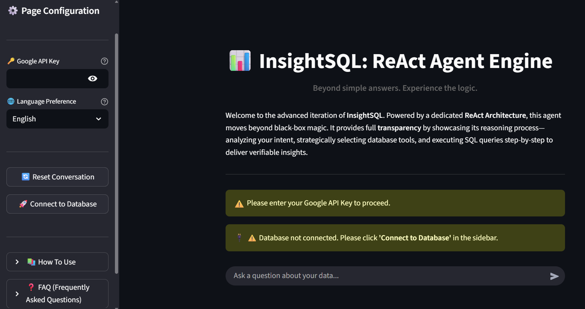
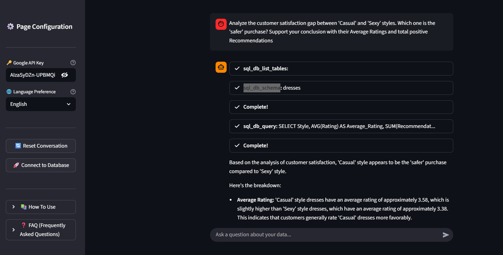
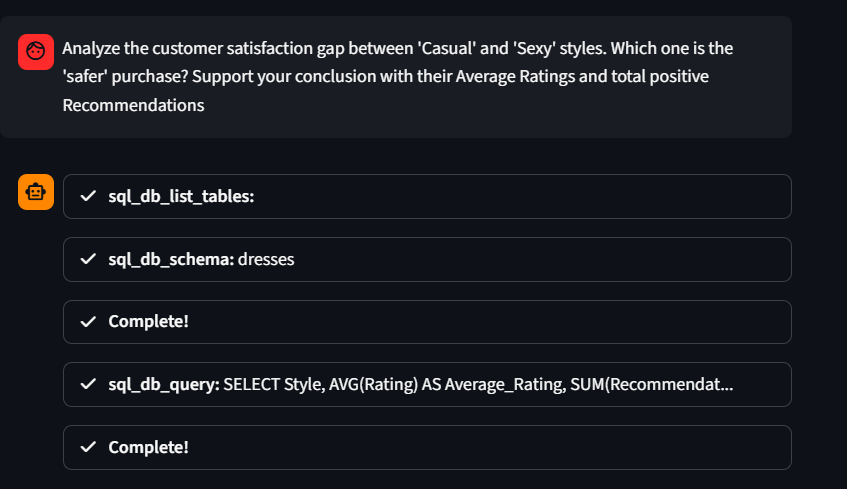

# 📊 InsightSQL (ReAct Agent Engine)


## 📌 Overview
**InsightSQL** is an advanced AI Data Assistant powered by **Google's Gemini 2.5 Flash** and built upon the **ReAct (Reasoning + Acting)** architecture.

Unlike standard chatbots, InsightSQL doesn't just guess answers. It actively **reasons** about your data. It connects to your SQLite database, understands the schema, constructs valid SQL queries, executes them, and translates the raw data into business insights—all in your preferred language (English or Indonesian).

## ✨ Key Features

### 🧠 Advanced ReAct Agent Engine
Using the `LangChain` ReAct framework, the agent follows a strict cognitive loop:
1.  **Thought:** Analyzes the user's question and decides which table/tool to use.
2.  **Action:** Generates and runs precise SQL queries.
3.  **Observation:** Reviews the database output to ensure accuracy.
4.  **Final Answer:** Synthesizes the data into natural language.

### 🌐 Multilingual Intelligence
* **Dual Language Support:** Seamlessly switch between **English** and **Indonesian**.
* **Smart Translation:** The agent enforces a strict logic layer to ensure the final answer matches your chosen language, regardless of the language used in the query (e.g., asking in Indonesian but getting the answer in English if configured).

### 🛠️ Professional Control & State Management
* **Dual Reset Modes:**
    * `🧹 Clear Screen Only`: Cleans the UI for a fresh look but **keeps the AI's memory** intact.
    * `🔄 Full System Reset`: Completely wipes memory, cache, and connections for a hard reboot.
* **Persistent Memory:** The agent remembers previous context, allowing for follow-up questions (e.g., *"What about the average price for that category?"*).

### 🛡️ Robust Error Handling
* **Self-Correction:** If the Agent generates invalid SQL, it catches the error, analyzes the traceback, and retries with a corrected query automatically.
* **Connection Safety:** Validates database paths and API keys before allowing interaction.

## 🛠️ Tech Stack
* **LLM:** Google Gemini 2.5 Flash (via `ChatGoogleGenerativeAI`).
* **Framework:** Streamlit (Frontend).
* **Orchestration:** LangChain (ReAct Agent, SQLDatabaseToolkit).
* **Database:** SQLite (via SQLAlchemy).
* **Memory:** ConversationBufferMemory.

## ⚠️ Limitations

### 1. Database Support
* Currently optimized for **SQLite (`.db`)** files only.
* The database file must be accessible via a local path relative to the application.

### 2. LLM Latency
* Complex queries requiring multiple "Thought/Action" steps (Multi-hop reasoning) may take a few seconds to process as the AI verifies its own logic.

## 📦 Installation

1.  **Clone the Repository**
    ```bash
    git clone https://github.com/viochris/InsightSQL-ReAct-Engine.git
    cd InsightSQL-ReAct-Engine
    ```

2.  **Install Dependencies**
    ```bash
    pip install -r requirements.txt
    ```

3.  **Setup Your Database**
    * Place your SQLite file (e.g., `dresses.db`) in the project root folder.
    * **Crucial:** If your file is named differently, open `app.py` and modify the connection URI (around line 180):
    
    ```python
    # Change 'dresses.db' to your actual filename
    db = SQLDatabase.from_uri("sqlite:///your_database_name.db")
    ```

4.  **Run the Application**
    ```bash
    streamlit run app.py
    ```

## 🚀 Usage Guide

1.  **Configuration (Sidebar):**
    * Enter your **Google Gemini API Key**.
    * Select your **Language Preference** (English/Indonesian).
2.  **Connect:**
    * Click **"🚀 Connect to Database"**.
    * *(Note: The app automatically connects to the database file defined in the code).*
    * Wait for the success toast notification.
3.  **Query:**
    * Type your question naturally (e.g., *"Mana baju yang paling mahal?"* or *"Analyze the rating distribution"*).
    * Watch the **"Thinking Process"** expander to see the SQL being generated.
4.  **Manage:**
    * Use **"🧹 Clear Screen Only"** to tidy up the chat interface while keeping context.
    * Use **"🔄 Full System Reset"** to wipe memory and restart the session (e.g., to enter a new API Key).

## 📷 Gallery

### 1. Landing Interface

*The clean, modern landing page offering quick configuration for API keys, database connection, and language settings.*

### 2. Intelligent SQL Execution

*The core experience. The Agent (Vio) processes the request, executes SQL in the background, and presents the result interactively.*

### 3. Transparent Reasoning & Logic
*The ReAct engine allows the user to inspect the logic. Below is an example of a specific query and the resulting insight provided by the AI.*

#### Step 1: Query & Reasoning Logic
  
*A complete view showing both the **User's Question** and the Agent's **Thinking Process**. The expanded section reveals how the AI interprets the prompt, decides on a tool, and constructs the SQL query (Thought → Action).*

<br>

#### Step 2: The Answer (Insight)
  
*The AI processes the SQL result and explains it in a business-friendly context, strictly adhering to the selected language.*

---
**Author:** [Silvio Christian, Joe](https://www.linkedin.com/in/silvio-christian-joe)
*"Stop writing complex queries. Start asking questions."*
